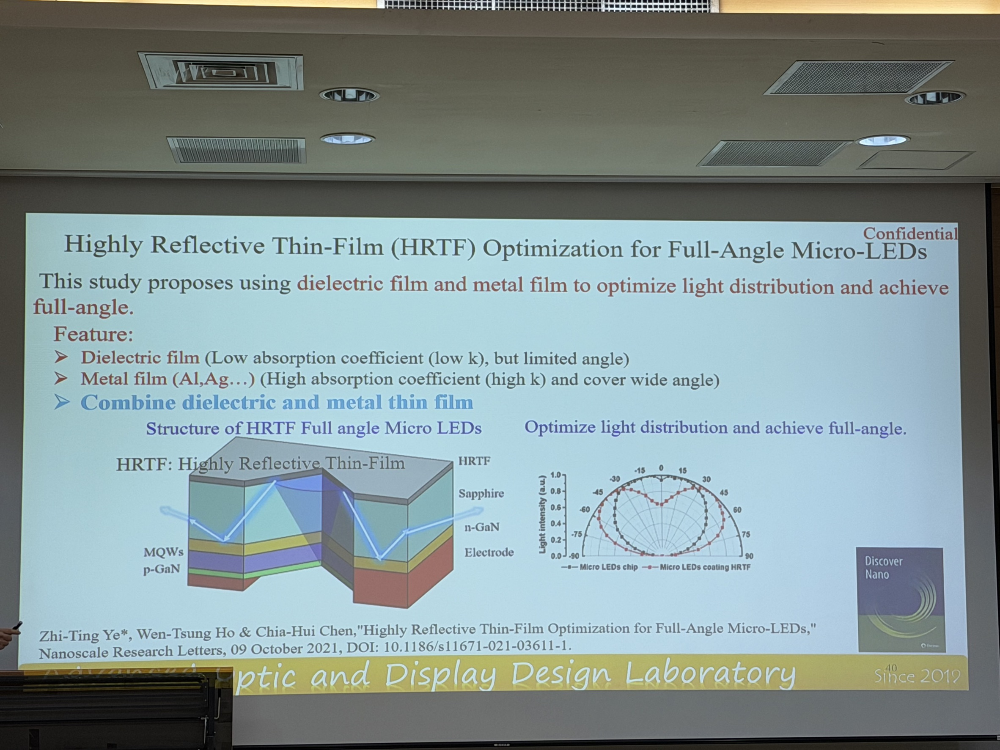
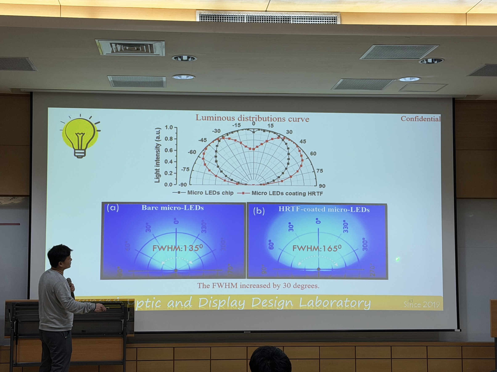
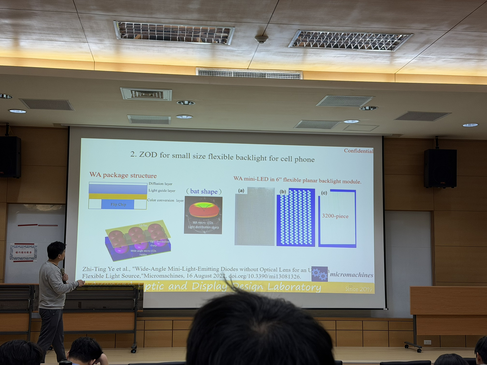
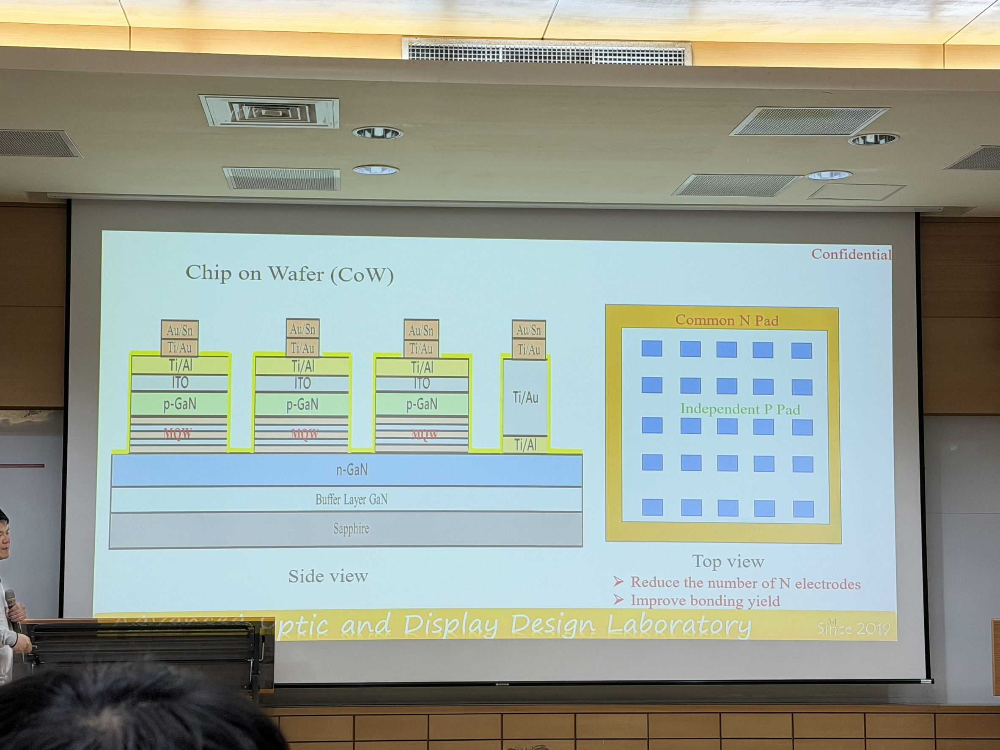

# Mini/Micro LED Design And Challenges For Advanced Displays
演講者：Dr. Zhi Ting 葉志庭 副教授  
演講日期：2026/03/03

## 一、LCD v.s. OLED v.s. Micro LED
### LCD
*   **優點：** 技術成熟且最便宜。
*   **缺點：** 對比度低。

### OLED
*   **優點：** 擁有很好的對比度 (純黑顯示)，體積輕薄。
*   **缺點：** 壽命低、容易出現烙應。

### Micro LED
*   **優點：** 擁有高亮度與高對比度。
*   **缺點：** 技術不純熟，且轉換率差 (ex. 如果能量以 100% 來說，只有 10% 轉換成光，其餘 90% 都是熱能)。

## 二、人眼的最大分辨率
以及介紹關於螢幕。**不同觀看距離**所需的 **PPI 、 Pixel** 要求就不同。當**距離愈遠**，所需的 PPI 、 Pixel 就**愈低**，以生活中的裝置來說：

### AR
*   **觀看距離：** 0.50 cm
*   **PPI：** 17.463.77
*   **Pixel：** 0.92

### VR
*   **觀看距離：** 5.00 cm
*   **PPI：** 1746.38
*   **Pixel：** 9.16

### Cell Phone
*   **觀看距離：** 20.00 cm
*   **PPI：** 436.59 (講者特別提到，蘋果公司以這個 PPI 數量最為著名)
*   **Pixel：** 36.65

### Watch
*   **觀看距離：** 30 cm
*   **PPI：** 291.06
*   **Pixel：** 54.98 

### TV
*   **觀看距離：** 150 cm
*   **PPI：** 58.21
*   **Pixel：** 274.89

## 三、Advanced Design Of Micro LED Display
講者說：如果想要讓自己的產品有競爭力，那就是想辦法將別人需要花 3 步完成的事情變成 2 步，甚至 1 步。以今天演講的題目來說，那就是想辦法減少 LED 數量，但要怎麼擁有一樣的顯示效果？

### Optimize Light Distribution
講者的 **「Highly Reflective Thin-Film Optimization for Full-Angle Micro-LEDs」** 期刊中提出：使用**介電薄膜**和**金屬薄膜**來優化光分佈 (透過兩顆 LED 形成類似心型的形狀，也就是實現全角度的顯示) ，就能大幅度減少 LED 的數量使用。

## 四、業界的開發經驗分享 (上課學不到的)
在實務開發時，必須先做 n-Gan 再做 p-Gan ，原因是因為 n-Gan 對溫度較低 (600 ~ 700 度)，若先做 p-Gan (900 度)，可能會融解。

