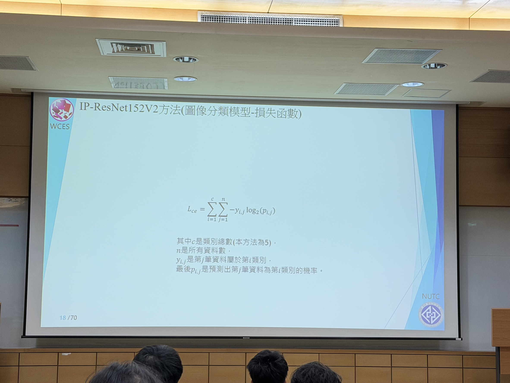
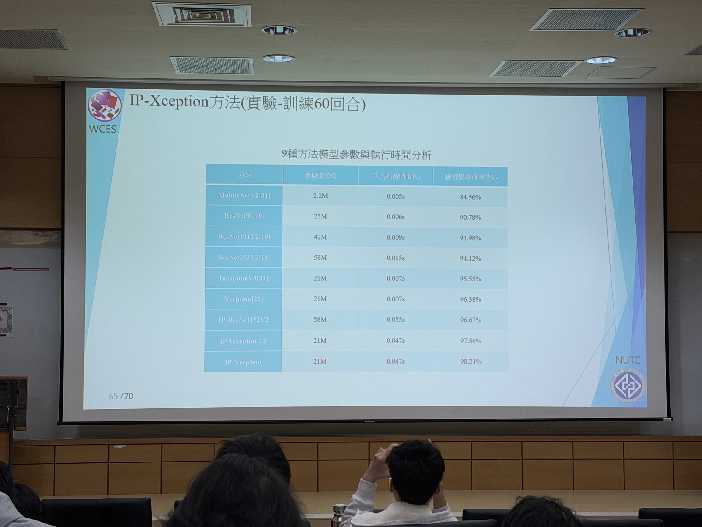
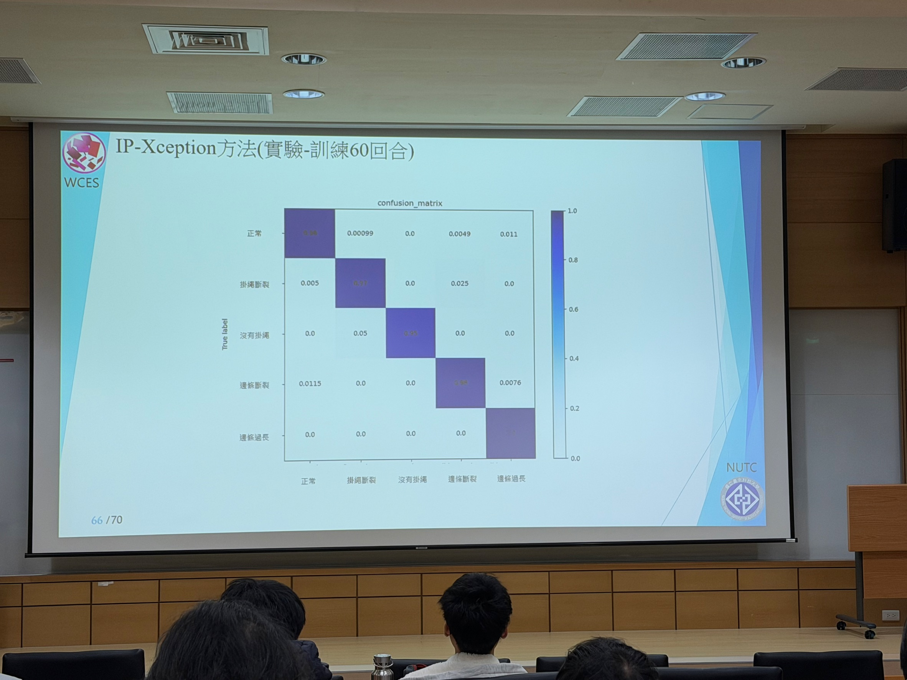

<h1 style="border-bottom: none;">
    1. 智慧系統設計與應用 - 智慧魚缸 
    2. Mask Inspection Management Systems 
    3. Imporing YOLOv8 Model for Object Detection of Remote Sensing Images
</h1>

> **演講者**：Dr. Young Long 陳永隆 教授兼任資訊與流通學院院長  
> **演講日期**：2026/03/10

 

## 一、卷積神經網路 (CNN)
類神經網路技術在影像領域上有不錯的發展，最為廣泛的就是**圖像分類**任務。在訓練模型時，**調整參數**是最花費時間也最為重要的，以下介紹幾個重要的參數。

### 1. 損失函數 (Loss Function)
訓練分類 (classification)、分群 (clustering) 模型時，關注的重點就是**損失函數**，也就是讓結果**收斂**

$$
L_{ce} = \sum_{i=1}^{c} \sum_{j=1}^{n} -y_{i,j} \log_2(p_{i,j})
$$

其中：
* $c$ 是類別總數，
* $n$ 是所有資料數，
* $y_{i,j}$ 是第 $j$ 筆資料屬於第 $i$ 類別，
* 最後 $p_{i,j}$ 是預測出第 $j$ 筆資料為第 $i$ 類別的機率。

### 2. 學習率 (Learning rate)
學習率是控制模型更新權重時的步伐大小。選擇適當的學習率可以幫助模型快速收斂，過高的學習率可能導致模型不穩定；過低則可能使訓練過於緩慢。

### 3. 訓練次數 (Epochs)
訓練次數指的是模型在所有訓練數據上完整訓練的次數。適當的訓練次數可以避免**過度擬合 (Overfitting)** 或訓練不足。

### 4. 批次大小 (Batch size)
批次大小是指每次更新權重時所使用的數據量。較大的批次大小可以提高計算效率，但可能需要更多的記憶體資源；較小的批次大小則可以提供更細緻的更新。

 

## 二、ResNet v.s. Inception v.s. Xception
講者分享了自己的研究生經過不斷的參數修改後，發現 **Xception** 方法可以使用「最少的資源 (參數值)」與「最少的時間」，來獲得「最大的準確率」。

### 1. 不同方法與執行時間分析 (訓練 60 回合)
| 方法 | 參數值(M) | 平均耗費時間(s) | 驗證集準確率(%) |
| :--- | :---: | :---: | :---: |
| MobileNetV2[31] | 2.2M | 0.005s | 84.56% |
| ResNet50[19] | 23M | 0.006s | 90.78% |
| ResNet101V2[19] | 42M | 0.009s | 91.98% |
| ResNet152V2[19] | 58M | 0.015s | 94.12% |
| InceptionV3[24] | 21M | 0.007s | 95.55% |
| Xception[22] | 21M | 0.007s | 96.38% |
| IP-ResNet152V2 | 58M | 0.055s | 96.67% |
| IP-InceptionV3 | 21M | 0.047s | 97.56% |
| IP-Xception | **21M**| **0.047s** | **98.21%** |

### 2. 混淆矩陣 (Confusion Matrix)

在 **IP-Xception** 模型中，各類別的預測分佈情況如下圖矩陣資料所示：

|  | **正常** | **掛繩斷裂** | **沒有掛繩** | **邊條斷裂** | **邊條過長** |
| :--- | :---: | :---: | :---: | :---: | :---: |
| **正常** | 0.98 | 0.00099 | 0.0 | 0.0049 | 0.011 |
| **掛繩斷裂** | 0.005 | 0.97 | 0.0 | 0.025 | 0.0 |
| **沒有掛繩** | 0.0 | 0.05 | 0.95 | 0.0 | 0.0 |
| **邊條斷裂** | 0.0115 | 0.0 | 0.0 | 0.98 | 0.0076 |
| **邊條過長** | 0.0 | 0.0 | 0.0 | 0.0 | 1.0 |

 

## 三、照片紀錄

