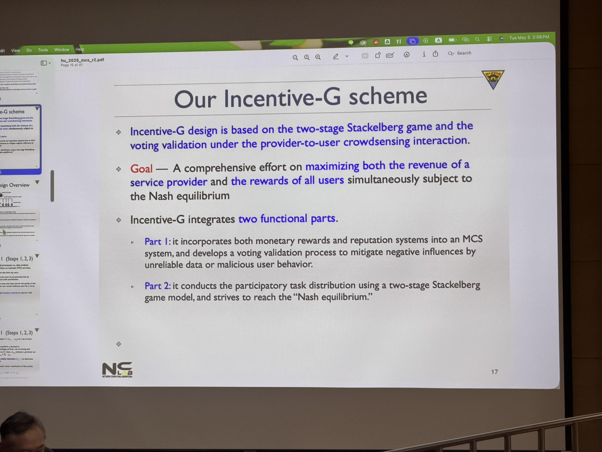
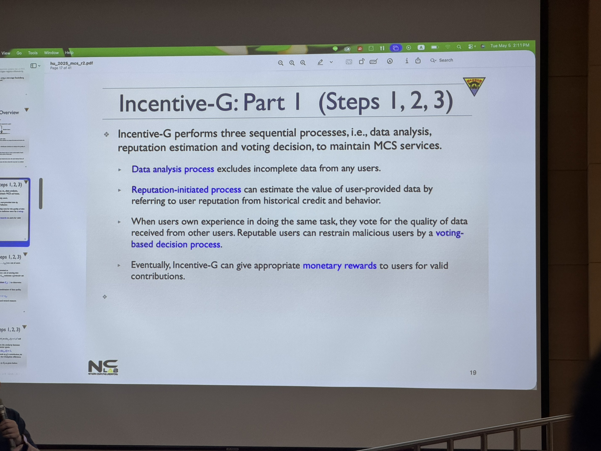
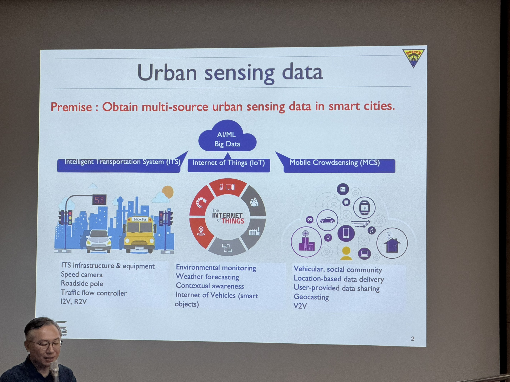
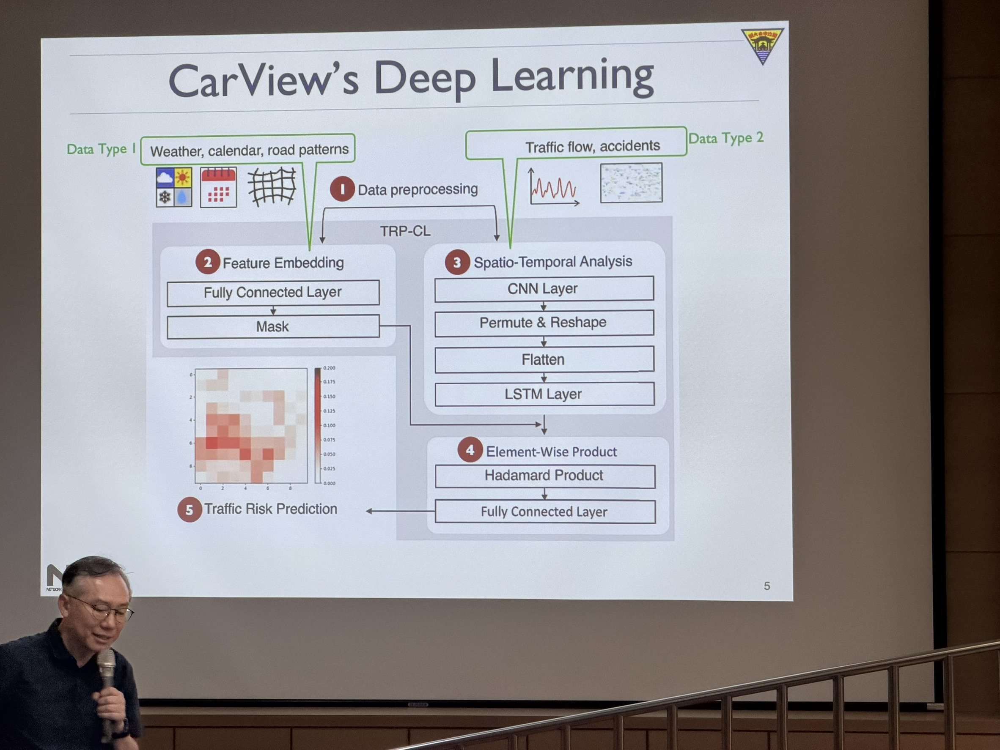
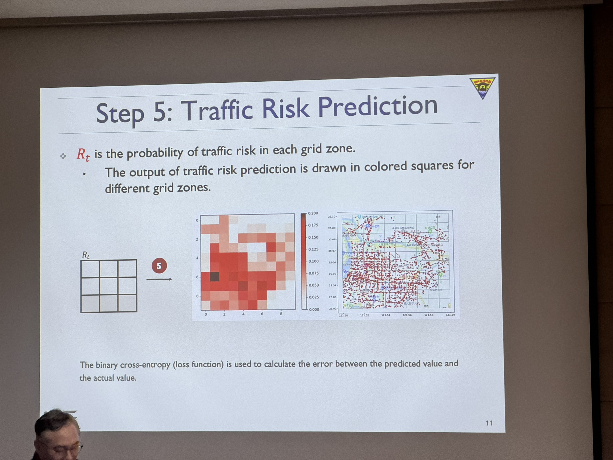
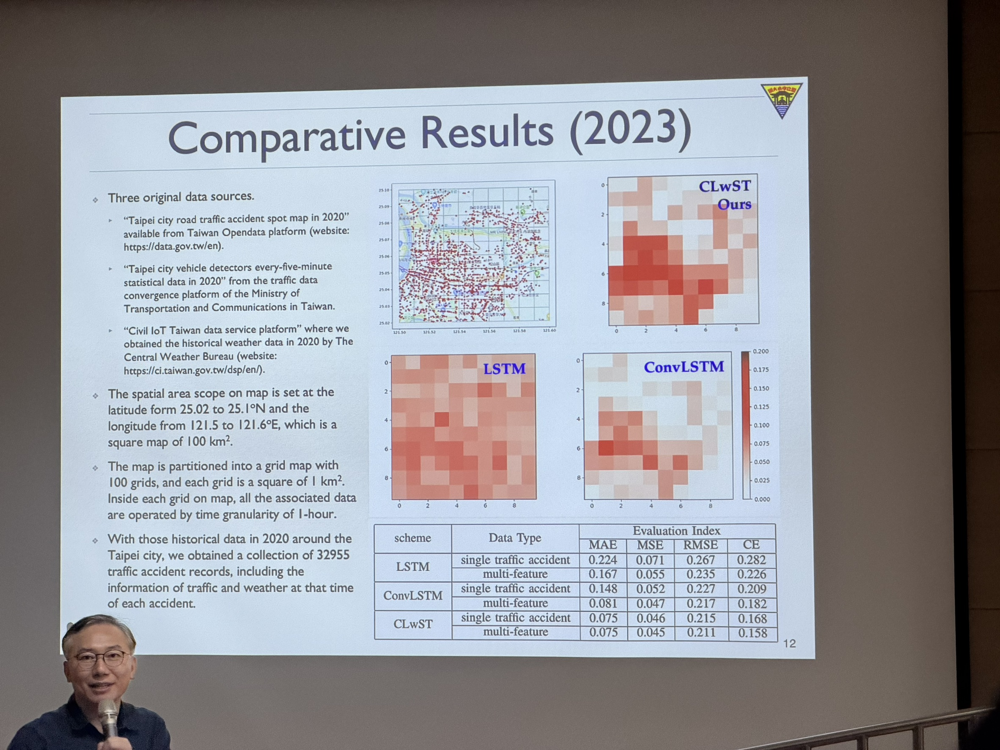
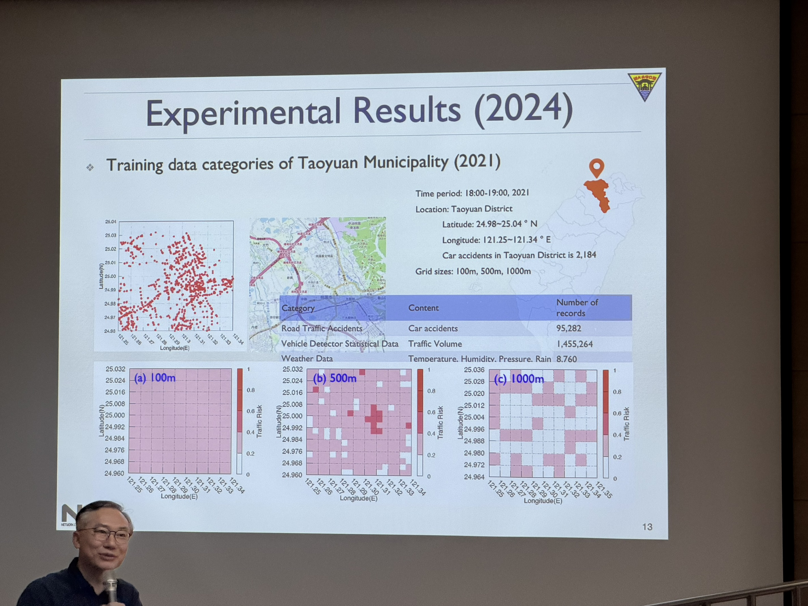
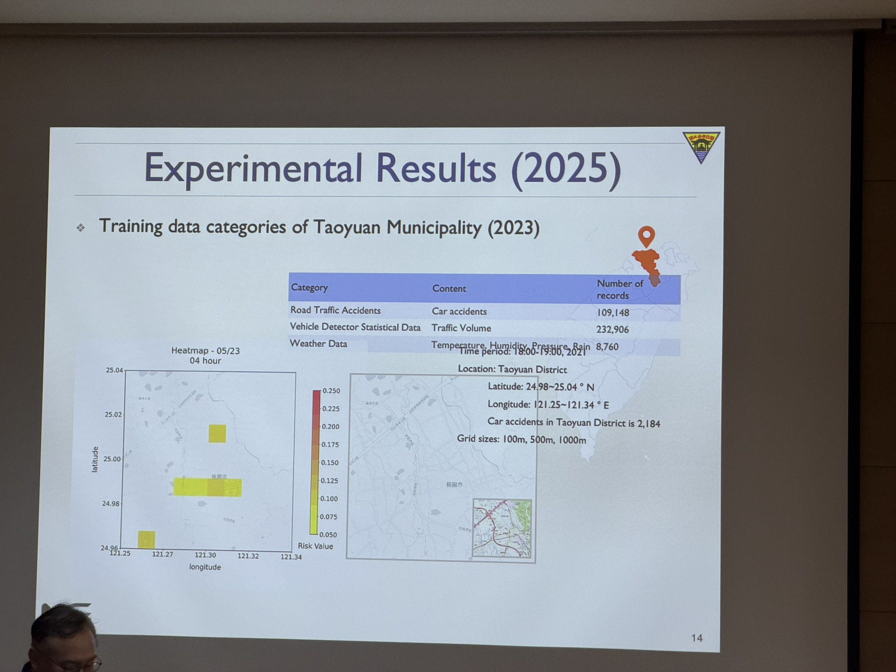
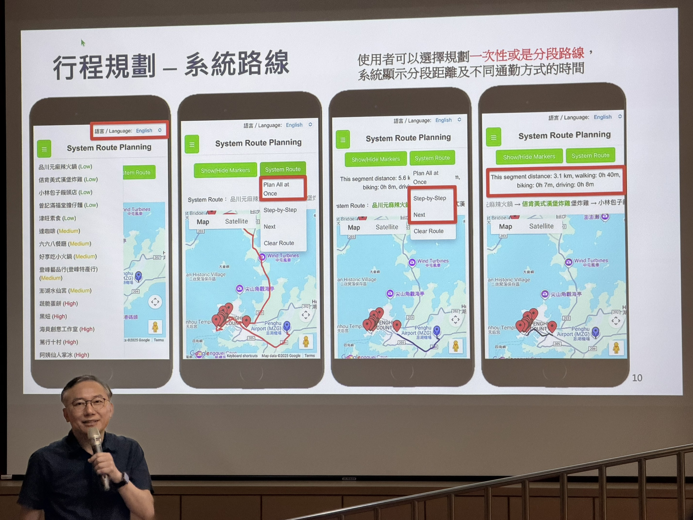

# Crowdsensing Techniques and Applications
> **演講者**：Dr. Chih-Lin Hu 胡誌麟 教授 (國立中央大學通訊工程學系)  
> **演講日期**：2026/05/05

胡教授今天共分享了三個主題，其中 Mobile Crowdsensing 內容篇幅較長。另外兩篇則為胡教授實驗室歷年來較有趣的專案分享。

## 壹、Mobile Crowdsensing (MCS)
Mobile Crowdsensing 主要在探討平台在收到資料後，透過察覺使用者的賽局策略，進而動態調整下一輪的任務排程與獎勵計算。

### 一、MCS 的挑戰

1. **資料的可靠性**：為了解決感測資料的不完整性、偽造與過度相似等問題，常見的方法包含：依據性別/年齡/位置分類使用者、分析歷史紀錄指派任務、計算資料相似度、區分誠實與惡意使用者以給予聲譽分數，以及透過使用者群組進行交叉驗證。

2. **獎勵機制**：一個可靠的 MCS 必須公平獎勵使用者，並透過懲罰來淘汰惡意使用者。其中，獎勵方式分為以下三點：
   * **Service experience**：說白了就像是你在論壇上的貢獻愈多，那你擁有的權限也就越大，透過這樣的獎勵機制不用支出額外費用，也可以讓使用者用起來感覺更好。
   * **Reputation credit**：根據提供資料的數量、品質給予評級，象徵使用者的個人價值貢獻。
   * **Monetary token**：補償使用者處理任務的成本，同時需要防範惡意使用者透過虛假資料來騙取獎勵。 

3. **行為管理**：如何有效補償提供資料的使用者，同時懲罰惡意行為。

### 二、解決方法的理論基礎

胡教授從經濟學角度比較了兩種理論在 MCS 中的應用：

1. **拍賣理論 (Auction theory)**：拍賣理論是一種經典的「誘因設計」，用來描述平台（服務提供者）與使用者之間的交易行為。
   * **運作方式**：系統透過類似「競標」的機制運作，例如，要求報酬較少（開價較低）的使用者就能獲得執行任務的機會。
   * **優點**：對於小規模感測社群來說，使用拍賣理論來建立模型是可行且有效的。
   * **缺點**：當 MCS 系統快速成長、規模變大時，拍賣機制的運作效能很難隨之提升。

2. **賽局理論 (Game theory)**：主要用來描述平台（服務提供者）與使用者之間的相互依賴性 (inter-dependency) 與因果關係 (causality)，並且能夠用來預測雙方採取的策略。賽局共分為兩種情境：
   * **Static game**：當「使用者」是賽局中唯一的玩家時，屬於靜態賽局。這主要聚焦於一般使用者之間的競爭，其優化目標通常是改善任務執行時間、增加完成的任務數，以及擴大感測範圍。
   * **Dynamic game**：用在模擬複雜的群眾感測行為。其中，最常被用來建立動態賽局模型的就是「斯塔克爾伯格賽局 (Stackelberg game)」又稱主從賽局。

3. **Stackelberg game**：這種動態賽局分為：服務提供者/平台 (service provider/platform)、使用者 (users)，以及請求者 (requesters) 三種角色，而這三種角色共構了一個互動。
   * **接單與派發**：服務提供者接收請求者的詢問與需求，並將感測任務分配給使用者。
   * **使用者決策**：使用者評估自身狀況後，決定是否要回報感測資料來換取獎勵。
   * **平台獲利**：服務提供者藉由提供這些感測資料，從中累積收益。

### 三、Incentive-G 機制

在符合納什均衡 (Nash equilibrium) 的前提下，同時最大化「服務提供者的收益」以及「所有使用者的獎勵」。其運作流程共分為四步驟：

1. **完成任務 (Accomplishing tasks)**：使用者考量自身處理任務的成本與風險後，決定是否接受任務並回傳資料以換取獎勵。

2. **分析資料 (Analyzing sensing data)**：服務提供者觀察收集到的資料分佈偏差，藉此衡量資料品質。

3. **更新聲譽 (Updating reputation values)**：服務提供者協調使用者對他人資料的結果進行投票，評分結果將直接影響該使用者的聲譽分數。

4. **更新獎勵 (Updating rewards)**：基於兩階段賽局模型，並綜合資料品質、聲譽與投票結果，服務提供者會分配最佳的獎勵給使用者。

#### Incentive-G: Part 1 (步驟 1, 2, 3) - 效用函數與指標設計

系統採用特定的效用函數 (Utility function) $U_{i,j}(\cdot)$ 來決定使用者的參與程度。這個函數是由資料品質、聲譽與投票分數的線性組合構成：

$$U_{i,j}(x_{i,j}, X_{-i,j}) = Q_{i,j}(\cdot) + \Gamma_{i,j}(\cdot) + R(\cdot) - c \cdot x_{i,j}$$

其中 $c \cdot x_{i,j}$ 代表成本，而三大核心指標分別為：

1. **資料品質監督 (Data quality supervision, $Q_{i,j}$)**：
   * **資料篩選 (Data screening)**：設定最低門檻 $\delta_j$ 來過濾資料。
   * **資料相似度 (Data similarity)**：使用柴比雪夫距離 (Chebyshev distance) 在 $z$ 維向量空間中測量兩筆不同資料記錄的相似度，並計算出品質分數 $Q_{i,j}$。

2. **聲譽分析 (Reputation analysis, $\Gamma_{i,j}$)**：
   聲譽評分函數由兩項組成：$\Gamma_{i,j}(L_i, P_{-i,j}) = H_i(L_i) + V_{i,j}(P_{-i,j})$。
   * $H_i(L_i)$ 代表使用者過去執行任務的歷史行為統計分析。
   * $V_{i,j}(P_{-i,j})$ 代表其他執行相同任務的使用者給予的投票分數 (Voting score)。

3. **獎勵衡量 (Reward measure, $R_{i,j}$)**：
   為了保持公平的獎勵政策，設計了包含投票分數 $V_{i,j}$ 的獎勵函數：$R_{i,j}(r_{i,j}, x_{i,j}, V_{i,j}) = r_{i,j}(x_{i,j} + \gamma \cdot V_{i,j})$。加入 $\gamma \cdot V_{i,j}$ 可以減輕因使用者提供虛假或不可靠資料所帶來的負面影響。

將上述指標整合後，即可得出從「資料數量、資料品質與聲譽」聯合視角來評估使用者貢獻的精煉效用函數 (Refined Utility function)。

#### 二、Incentive-G: Part 2 (步驟 4) - 兩階段賽局模型與收益公式

此階段運用兩階段斯塔克爾伯格賽局模型 (Two-stage Stackelberg game model) 來解釋使用者行為與獎勵效應。

* **角色定位**：服務提供者扮演賽局中的「領導者 (Leader)」，負責決定獎勵政策與分配任務；使用者則為「跟隨者 (Followers)」，決定是否執行任務以賺取獎勵。

* **收益公式 (Revenue Formulation, $\mathfrak{M}_j$)**：服務提供者的收益是「從使用者收集到的感測資料總收益」與「支付給使用者的總獎勵」之間的淨餘額。公式利用線性二次函數 (linear-quadratic function) 將資料轉換為金錢收入，並透過係數 $\varepsilon_1$ (最大化個人貢獻) 與 $\varepsilon_2$ (團隊合作的邊際收益遞減) 來調整使用者貢獻的邊際效應，以防止使用者過度提供資料來獲取超額獎勵。

* **賽局的兩個階段與最佳化目標**：
  系統的最佳目標 (Optimal goal) 是在斯塔克爾伯格賽局中達到納什均衡 (Nash equilibrium)，同時獲得最大收益與獎勵。賽局分為兩個循序漸進的階段：
  1. **第一階段 - 最大收益賽局 (Maximum revenue game)**：服務提供者 $C$ 透過最佳獎勵策略找出能最大化總收益的一組最佳獎勵集合 $\mathfrak{R}_j^*$。

  2. **第二階段 - 最佳資料提供賽局 (Best data provision game)**：每個使用者為了獲得最大的淨利益與聲譽，會採取有利的行動，找出最佳的資料提供策略 $x_{i,j}^*$ 以最大化其效用值。

## 貳、Urban Sensing and its Smart Application on Predicting Road Traffic Risks 專案分享(1)
這套系統結合了Google Maps，當使用者搜尋好導航路徑後，系統會根據交通事故的歷史API， 將不同路徑上的危險程度透過顏色深淺標示出來，使用者可以選擇相對安全的路徑前往目的地。我認為這套系統非常新穎，而且具有一定的實用價值。

### 一、核心動機與挑戰

1. **數據來源**：研究整合了多種感測數據，包括智慧交通系統 (ITS)（如測速照相、車流控制器）、物聯網 (IoT)（如氣象、環境監測）以及行動群眾感測 (MCS)（如車輛間通訊 V2V、用戶分享的數據）。

2. **時空複雜性**：交通數據具有高度的時空關聯性。例如，相鄰地點的交通會互相影響（空間），而不同時段的車流也互有關連（時間），這些複雜因素讓風險預測變得困難。

### 二、技術架構：CarView 深度學習模型

研究提出了一個結合多種 AI 技術的方案，具體步驟如下：

1. **數據預處理**：處理缺失值，並將地圖劃分為 $I \times J$ 的網格。收集的數據分為兩類：
   * **Type 1**：氣象（溫濕度、降雨、風速）、時間戳記、節假日及道路類型。
   * **Type 2**：車流量、車速及各網格的事故數量。

2. **模型組成**：
   * 使用卷積神經網路 (CNN) 處理空間特徵。
   * 使用長短期記憶模型 (LSTM) 處理時間序列特徵。
   * 透過 Hadamard Product (逐元素乘積) 結合不同特徵，並透過 ReLU 激活函數加速訓練。

### 三、研究成果與應用

1. **預測地圖**：系統最終會輸出一個網格化的交通預警地圖。顏色越深的地方代表交通風險（機率 $R_t$）越高，能直觀地提供給駕駛人參考。

2. **實證分析**：研究使用了 2020 年台北市的數據進行測試（包含約 3.3 萬筆事故記錄），涵蓋範圍約 100 平方公里。

3. **效能領先**：比較結果顯示，該研究所提的 CLwST 模型在預測誤差（如 MAE, RMSE 等指標）上，優於傳統的單一 LSTM 或 ConvLSTM 模型。

## 參、基於大數據與機器學習之澎湖旅遊資訊的智慧推薦服務 專案分享(2)
這篇也是相對有趣的專案之一，這套推薦服務系統會根據過去遊客旅遊時的足跡與時間，將最多人選擇的景點推薦給新來的遊客，且系統上還會顯示目前該景點的即時人數，協助使用者避開尖峰時段。

可惜說明該專案時，演講時間將盡，因此沒有太詳細做技術介紹。

## 肆、心得
胡教授最開始演講的主題「Mobile Crowdsensing」中，有許多我們資工系不會聽到的專有名詞，其中「賽局理論」是這個主題的核心理論之一，剛開始我幾乎聽不懂，但在教授透過深入淺出的分析（包含拍賣理論與斯塔克爾伯格賽局）後，我逐漸理解了平台如何透過設計效用函數與獎勵機制，來平衡雙方利益並過濾惡意資料。

此外，後半段的兩個實務專案（交通事故風險預測與澎湖智慧旅遊推薦）令我為之一亮。這些專案不但具備扎實的理論模型（如結合 CNN 與 LSTM 的 CarView 模型），還實際運用了大量的場域數據（如台北市的交通數據及澎湖的遊客足跡）。這些內容讓我深刻體會到，將複雜的數學模型與 AI 技術落地並轉化為解決現實社會痛點的應用，是一件多麼有價值的事情，整場演講拓展了我在群眾感測與智慧城市應用上的視野，實在是獲益良多。

## 伍、關鍵字

1. **行動群眾感測 (Mobile Crowdsensing, MCS)**
2. **賽局理論 (Game Theory)**
3. **斯塔克爾伯格賽局 (Stackelberg Game / 主從賽局)**
4. **獎勵機制 (Incentive Mechanism)**
5. **納什均衡 (Nash Equilibrium)**
6. **時空數據預測 (Spatio-Temporal Prediction)**
7. **卷積神經網路與長短期記憶模型 (CNN & LSTM)**
8. **智慧城市與交通預測 (Smart City & Traffic Prediction)**

## 陸、參考文獻

1. **Incentive Mechanism for Mobile Crowdsensing With Two-Stage Stackelberg Game**：
   Hu, C. L., Lin, K. Y., & Chang, C. K. (2023). *Incentive Mechanism for Mobile Crowdsensing With Two-Stage Stackelberg Game*. IEEE Transactions on Services Computing.
2. **Game Theory**：
   Osborne, M. J., & Rubinstein, A. (1994). *A course in game theory*. MIT press. (介紹納什均衡與靜態/動態賽局的經典教科書)
3. **Stackelberg Game**：
   Von Stackelberg, H. (2010). *Market structure and equilibrium*. Springer Science & Business Media. (原著發表於 1934 年，主從賽局模型概念的起源文獻)
4. **LSTM**：
   Hochreiter, S., & Schmidhuber, J. (1997). *Long short-term memory*. Neural computation, 9(8), 1735-1780. (提出 LSTM 神經網路架構解決時間序列問題的原始經典論文)
5. **Spatio-Temporal Deep Learning**：
   Shi, X., Chen, Z., Wang, H., Yeung, D. Y., Wong, W. K., & Woo, W. C. (2015). *Convolutional LSTM network: A machine learning approach for precipitation nowcasting*. Advances in neural information processing systems, 28. (奠定利用 CNN 結合 LSTM 處理網格化時空數據基礎的重要文獻，常被應用於交通或車流預測)
