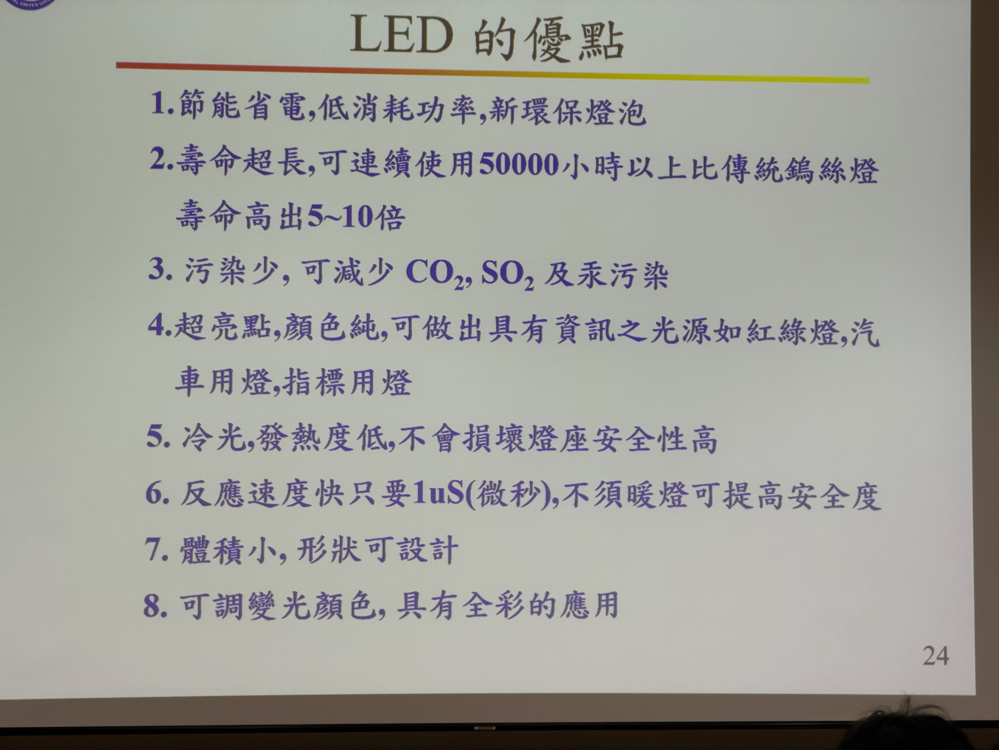
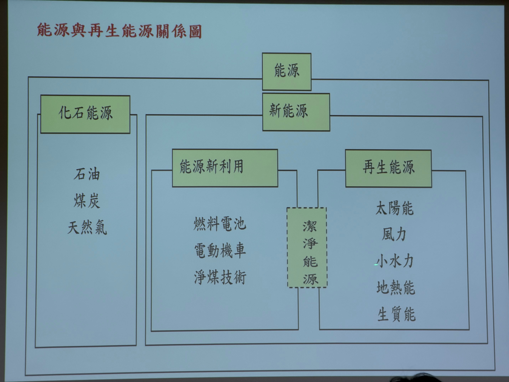

# 綠色科技與光電元件之發展應用

> **演講者**：Dr. Sheng-Joue Young 楊勝州 教授 (國立雲林科技大學 電子工程系)  
> **演講日期**：2026/05/12

楊教授今天的演講內容較特別，他的演講著重於綠能市場的"前瞻性"，非常特別。

## 壹、綠色科技

宗旨在於：節能減碳，降低能耗並減少空氣汙染。

1. **綠色能源（太陽能）**：利用自然界中可再生的能源，轉換過程中幾乎不產生溫室氣體，例如：太陽能發電。

2. **綠色食品（有機、無農藥）**：不使用化學合成的農藥與肥料，重視生態平衡、水源保護及土壤健康，對環境及人體都更為友善。

3. **綠色交通（腳踏車）**：提倡低碳或零排放的交通方式。

4. **綠色建築**：在建築物的設計上著重於良好的自然採光、通風、雨水回收，並使用環保綠建材以降低整體能耗。

5. **綠色照明（發光二極體）**：以LED (Light-Emitting Diode) 為主，相較於傳統白熾燈泡或螢光燈，LED具備發光效率高、使用壽命長、耗電量小且不含汞等有毒物質的特性。

6. **綠色材料（水、樹葉、氧化鋅材料）**：強調天然、可生物降解或具備環保功能的材料。

7. **綠色家電（motorola 可自動分解手機）**：指在製造、使用及廢棄過程中對環境影響降到最低的電子產品。

## 貳、能源與再生能源關係

根據「能源與再生能源關係圖」，能源主要可分為「化石能源」與「新能源」兩大類：

1. **化石能源**：包含石油、煤炭、天然氣等傳統能源。

2. **新能源**：進一步區分為以下兩大分支，並共同架構出「潔淨能源」的概念：
   * **能源新利用**：著重於提升能源效率與減少汙染，包含燃料電池、電動機車、淨煤技術等。
   * **再生能源**：自然、生生不息的能源，包含太陽能、風力、小水力、地熱能、生質能等。

## 參、太陽能電池種類

根據目前市場上最主要的產品，太陽能電池可分為以下幾種：

1. **矽晶圓太陽能電池**
2. **非晶系矽太陽能電池**
3. **銅銦鎵二硒太陽能電池**
4. **鎘碲薄膜太陽能電池**
5. **矽薄膜太陽能電池**
6. **染料敏化太陽能電池**
7. **化合物(GaAs)太陽能電池**
8. **奈米太陽能電池**
9. **鈣鈦礦太陽能電池**

## 肆、鈣鈦礦（最新的太陽能電池技術）

鈣鈦礦是太陽能電池目前發展的重要技術，具有非常好的彎曲延展性、輕薄、成本低......等優勢，黃仁勳與馬斯克兩大巨頭都看好這項技術的發展，馬斯克也期望未來能應用於太空上。  
值得一提的是，楊教授實驗室已經發展太陽能發電多年，目前也接有鈣鈦礦技術研發的合作計畫，已經有辦法將能源轉換率控制在 20% 左右，而最理想的轉換率是 40% 左右。

1. **介紹**：鈣鈦礦（有機-無機混合鹵化物）具備極佳的吸光能力與電荷傳輸效率，只需幾百奈米的極薄厚度，就能發揮出色的光電轉換效率，相較於厚度高達數十微米的傳統矽晶電池要輕薄許多。在製程方面，傳統矽晶電池必須在超過 1000°C 的高溫下進行材料純化與加工，非常耗能且受限於耐高溫的基板材料。相對地，鈣鈦礦電池只需在 100°C 至 150°C 的低溫環境，利用簡單的溶液塗佈或蒸鍍技術即可製作，大幅減少了製程耗能，而這種低溫特性使得鈣鈦礦可直接製作在塑膠等軟性基材上，為未來「可撓式」太陽能產品的應用帶來無限可能。

2. **台灣發展中的公司**：楊教授特別介紹，目前台灣發展中的概念公司包含：元晶、茂迪、聯合再生，其中還有陳來助董事長成立的 「台灣鈣鈦礦科技」，楊教授也提到：未來的五年可能是這項技術起飛的時間。